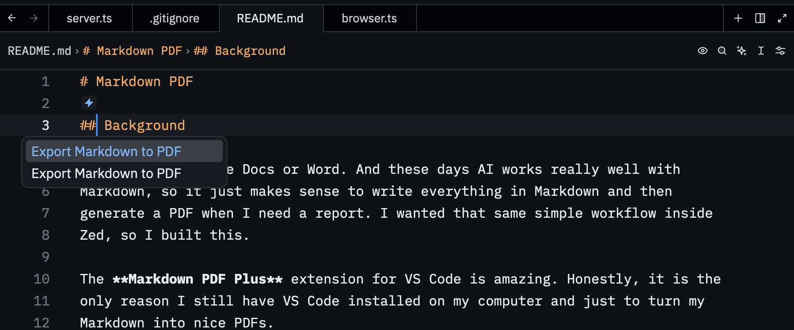

# Markdown PDF

## Background

I don't like Google Docs or Word. And these days AI works really well with
Markdown, so it just makes sense to write everything in Markdown and then
generate a PDF when I need a report. I wanted that same simple workflow inside
Zed, so I built this.

The **Markdown PDF Plus** extension for VS Code is amazing. Honestly, it is the
only reason I still have VS Code installed on my computer and just to turn my
Markdown into nice PDFs.

## Overview

Export any Markdown file to a beautifully styled PDF — without leaving [Zed](https://zed.dev).

Open a `.md` file, run **Export Markdown to PDF**, and a `.pdf` lands right next to
your document. Code blocks are syntax-highlighted, math renders with KaTeX,
Mermaid diagrams are drawn, and task lists, footnotes, and tables all carry over.

## Features

- 🖨️ One-action export to PDF from any Markdown buffer
- 🎨 Syntax highlighting (highlight.js) and clean, readable typography
- ➗ LaTeX math via KaTeX (`$inline$` and `$$block$$`)
- 📊 Mermaid diagrams
- ✅ GitHub-style task lists, footnotes, tables, and heading anchors
- 🧩 Custom CSS, page size, and margins via settings
- 🌐 Uses a browser you already have (Chrome / Edge / Brave / Chromium); downloads
  a headless Chromium only as a last resort

## Requirements

- **Node.js 18+** on your `PATH`. The export engine runs as a native helper
  process, which Zed launches with your installed `node`.
  > Tip: if Zed is opened from the macOS Dock/Finder and can't find `node`,
  > launch it once from a terminal (`zed`) so it inherits your shell `PATH`.
- **A Chromium-based browser** (Google Chrome, Edge, Brave, or Chromium) is used
  for rendering. If none is found, a headless Chromium is downloaded automatically
  on first export and cached under `~/.cache/markdown-pdf`.

## Install

1. Open the command palette → **zed: extensions**.
2. Search for **Markdown PDF** and click **Install**.

The first export downloads the rendering helper; subsequent exports are instant.

## Usage

1. Open any `.md` file.
2. Press **`cmd-.`** (macOS) or **`ctrl-.`** (Linux/Windows) to open the
   code-actions menu — or click the ⚡ icon that appears next to the line.
3. Choose **Export Markdown to PDF**.



> Zed has no command-palette entry for extensions, so the export lives in the
> code-actions menu. Just remember: open a `.md`, hit **`cmd-.`**, pick
> **Export Markdown to PDF**.

The PDF is written next to your source file as `<filename>.pdf` (configurable
below). A progress notification shows each stage; a final notification reports the
written path.

## Settings

Configure exports in your Zed `settings.json` under the language server:

```json
{
  "lsp": {
    "markdown-pdf-lsp": {
      "settings": {
        "pageSize": "A4",
        "marginTop": "20mm",
        "marginBottom": "20mm",
        "marginLeft": "18mm",
        "marginRight": "18mm",
        "cssPath": "",
        "cssRaw": "",
        "usePageStyleFromCSS": false,
        "outputHome": "",
        "outputFilename": ""
      }
    }
  }
}
```

| Setting               | Default  | Description                                                                 |
| --------------------- | -------- | --------------------------------------------------------------------------- |
| `pageSize`            | `"A4"`   | Paper size (`A4`, `Letter`, `Legal`, …).                                    |
| `marginTop`           | `"20mm"` | Top margin (any CSS length).                                                |
| `marginBottom`        | `"20mm"` | Bottom margin.                                                              |
| `marginLeft`          | `"18mm"` | Left margin.                                                                |
| `marginRight`         | `"18mm"` | Right margin.                                                               |
| `cssPath`             | `""`     | Path to an extra stylesheet (absolute, or relative to the source file).     |
| `cssRaw`              | `""`     | Inline CSS injected as the highest-priority style layer.                    |
| `usePageStyleFromCSS` | `false`  | Defer page size and margins to the document's own `@page` CSS rules.        |
| `outputHome`          | `""`     | Output directory. Empty → the source file's directory (created if missing). |
| `outputFilename`      | `""`     | Output file name without extension. Empty → the source base name.           |

## How it works

Zed extensions run in a `wasm32-wasip2` sandbox and can't spawn a browser directly.
This extension ships a thin WASM coordinator that launches a native **Node.js LSP
sidecar**; the sidecar renders Markdown → HTML (`markdown-it` + `cheerio`) and
prints it with headless Chromium (`puppeteer-core`). The export is offered as an
LSP code action because Zed surfaces those in the `cmd-.` menu.

```
+---------------------+        +-------------------------------+
| Zed (WASM sandbox)  |  LSP   | markdown-pdf sidecar (Node)   |
| src/lib.rs          | <----> | sidecar/dist/server.js        |
| - locates `node`    | stdio  | - markdown-it -> cheerio      |
| - downloads sidecar |        | - puppeteer-core -> page.pdf()|
+---------------------+        +-------------------------------+
```

## Development

```sh
# 1. Build the WASM coordinator
rustup target add wasm32-wasip2          # rustup-managed Rust required
cargo build --release --target wasm32-wasip2

# 2. Build the sidecar
cd sidecar && npm install && npm run build && cd ..

# 3. Run Zed against this folder, bypassing the GitHub release download
export MARKDOWN_PDF_SIDECAR_JS="$PWD/sidecar/dist/server.js"
zed --foreground .
# Zed: command palette → "zed: install dev extension" → pick this folder
# open any .md → cmd-. → "Export Markdown to PDF"
```

`MARKDOWN_PDF_SIDECAR_JS` points the coordinator at your local build so you don't
need a published release while iterating. Verify the LSP handshake at any time:

```sh
node scripts/smoke-lsp.mjs sidecar/dist/server.js
```

### Releasing

CI is tag-driven (`.github/workflows/release.yml`):

1. Bump `version` in both `extension.toml` and `Cargo.toml` (keep them equal).
2. `git tag vX.Y.Z && git push --tags`.

The `release` workflow builds and bundles `markdown-pdf-sidecar.tar.gz`, attaches
it to the GitHub Release (the coordinator downloads it at runtime), then opens the
version-bump PR against [`zed-industries/extensions`](https://github.com/zed-industries/extensions).
See the comments in the workflow for the one-time fork + `COMMITTER_TOKEN` setup.

## License

[MIT](./LICENSE)
